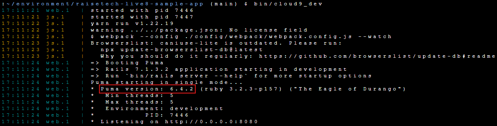
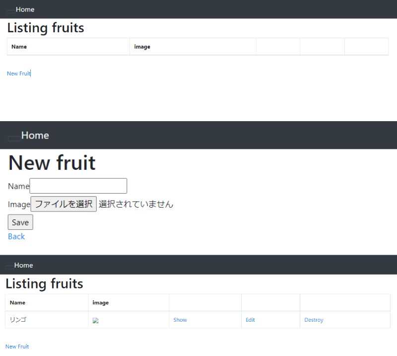
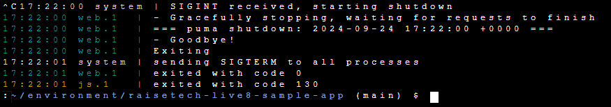
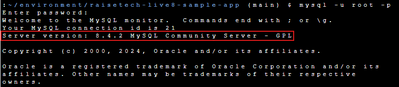
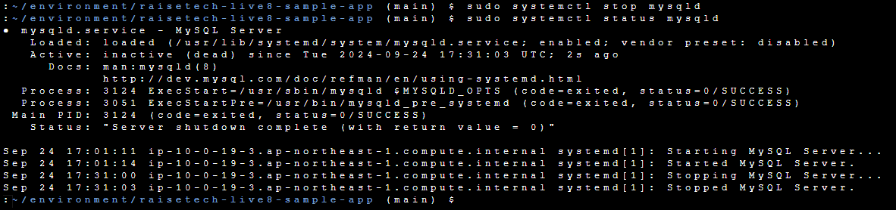
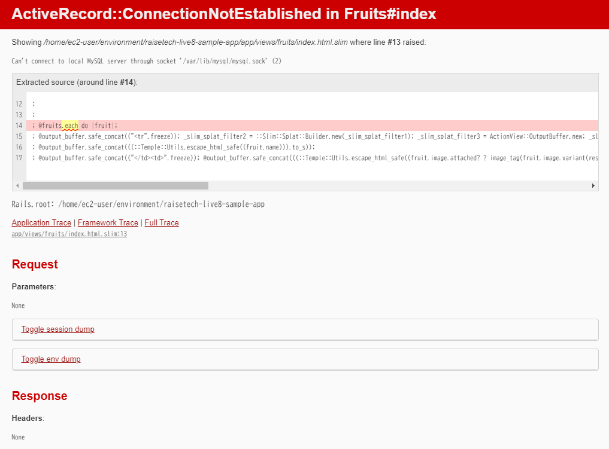

## 第3回課題

### AP サーバーについて調べる
- APサーバーの名前：Puma
- APサーバーのバージョン：6.4.2  
**APサーバーの名前・バージョン**

**アプリケーション画面**  

- APサーバーを終了させた場合、引き続きアクセス可能か：アクセスできない  
**APサーバー終了コマンド**  

### DB サーバーについて調べる
- DBサーバーの名前：MySQL
- DBサーバーのバージョン：8.4.2  
**DBサーバーの名前・バージョン**  

- DBサーバーを終了させた場合、引き続きアクセス可能か：アクセスできない  
**DBサーバー終了コマンド**  

**DBサーバー終了後アクセス結果**  

### Railsの構成管理ツールの名前
- Bundler

### 講座感想
今回の課題では、アプリケーションをEC2上で稼働させる際に、READMEの内容だけでは起動できず、追加の対応が必要でした。  
自分なりに問題解決を試みましたが、行き詰まってしまい、講義でのウシジマさんの作業を参考にしたところ、無事に起動させることができました。  
今後はさらに経験を積み、ウシジマさんのように、経験に基づいてスピーディーに対応できるエンジニアを目指したいと思います。
