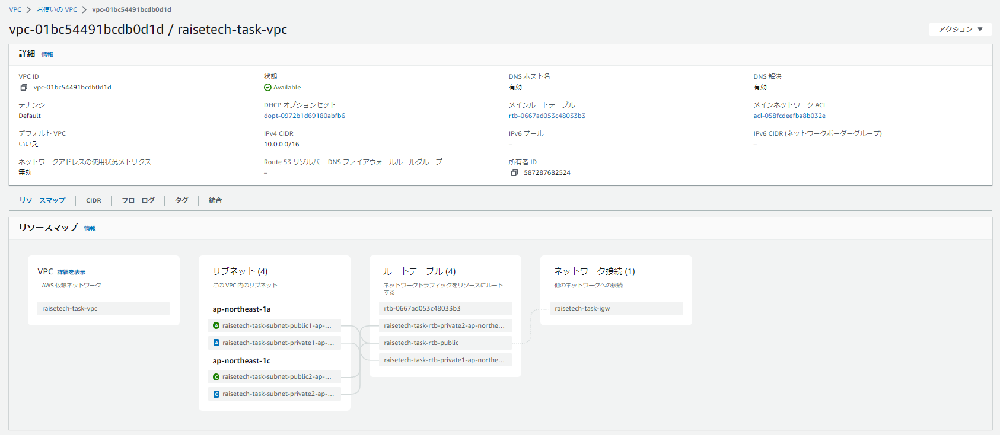
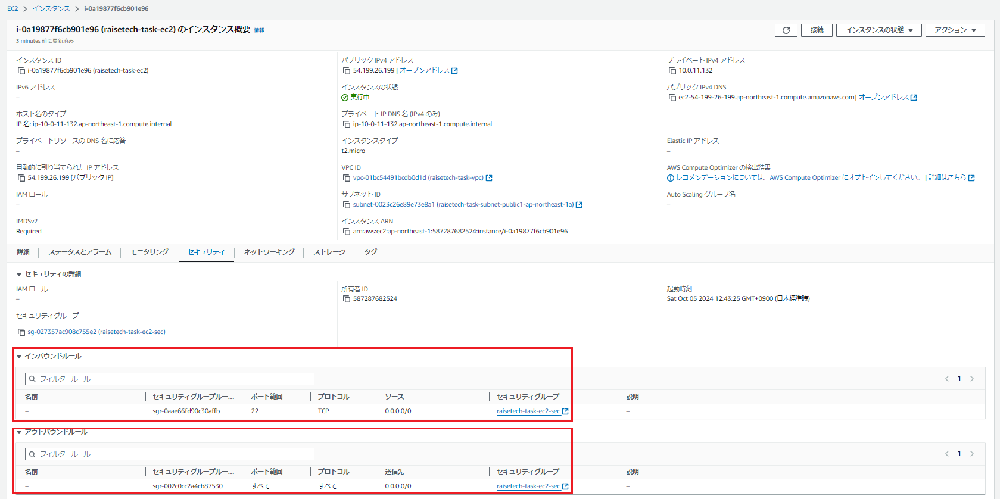
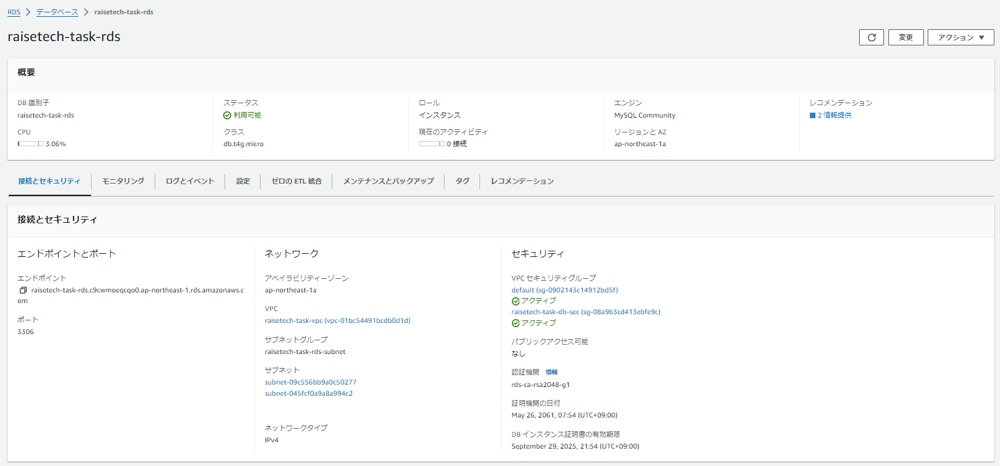
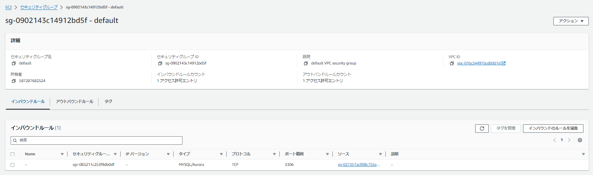
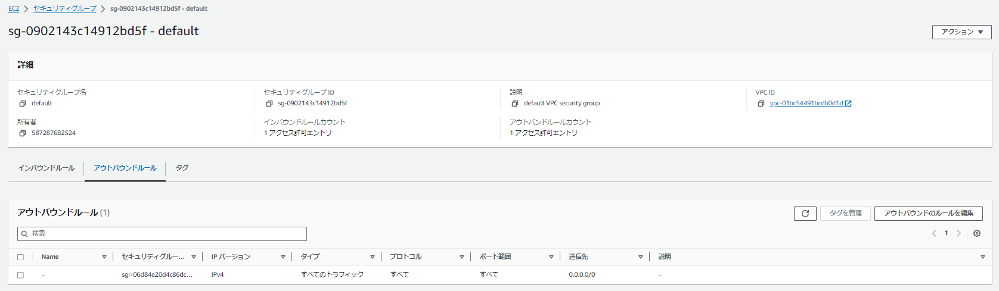
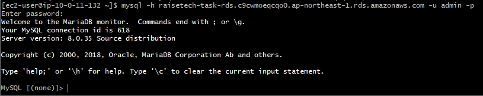

## 第4回課題

### VPCの作成
**作成したVPC**  

### EC2の作成
**作成したEC2とセキュリティグループの設定**  

### RDSの作成
**作成したRDS**  
  

**セキュリティグループ：インバウンドルール**  
  

**セキュリティグループ：アウトバウンドルール**  

## EC2からRDSへの接続確認

### 講座感想
AWSのコンソールでできることやセキュリティグループについて、まだ十分に理解できていない部分が多く、今回の課題では、作成と削除を何度も繰り返してしまった。時間はかかると思うが、今のうちにコンソールで様々な操作を試し、業務で必要になった際にスムーズに扱えるようになりたい。

