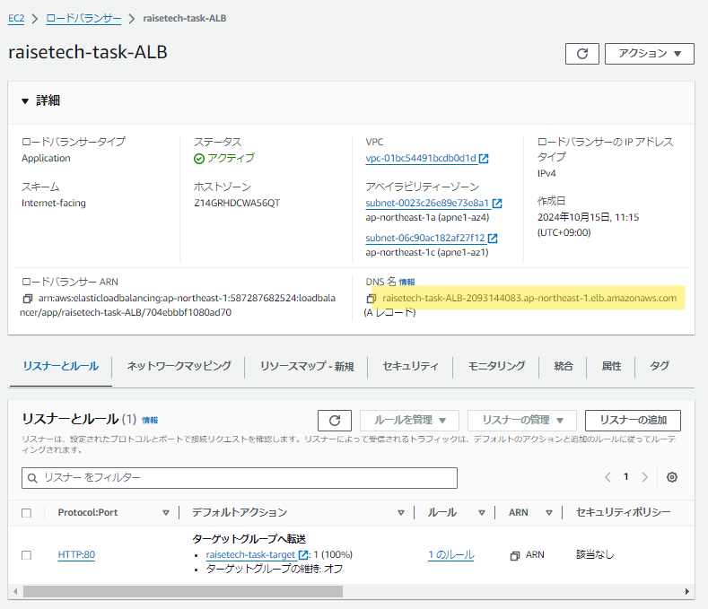

## 第5回課題

### 組み込みサーバー（Puma）で確認
**起動画面**  
  

**画面表示確認**  
  

### 組み込みサーバーとUnix Socketで確認
**起動画面**  
  

**接続確認**  
  

### Nginxの単体起動確認
**起動画面**  
  

**画面確認**  
  

### Nginxと組み込みサーバ、UnixSocketで確認
**起動画面**  
  

**画面確認**  
  

### ALB追加確認
**DNS名確認**  
  

**画面確認**  
  

### S3追加確認
**画面確認**  
  

**S3コンソール確認（追加前）**  
  

**S3コンソール確認（追加後）**  
  

### 構成図
  

### 講座感想
ALBとS3の構築はスムーズにできましたが、EC2にサンプルアプリの環境を作るところでかなり苦戦しました。  
セキュリティグループの設定でハマったおかげで、セキュリティグループ周りの理解が深まったと思います。この調子でどんどん詰まりながらも解決して、AWS全体の理解をもっと深めていきたいです。
