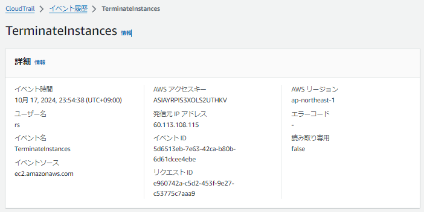
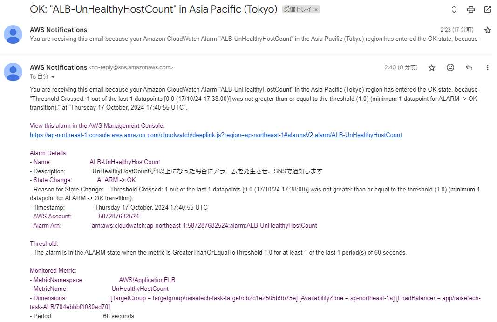
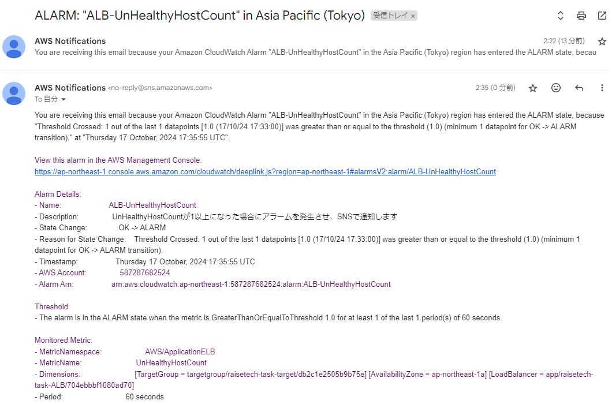
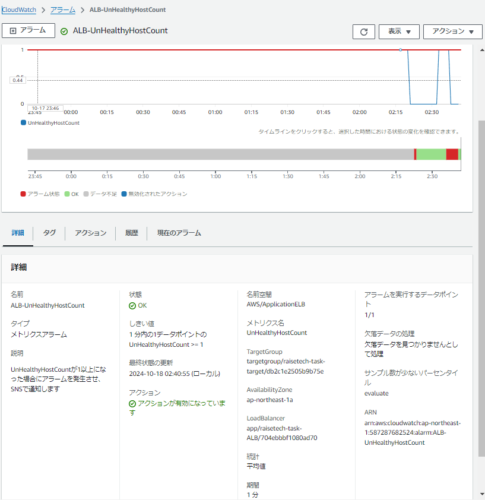
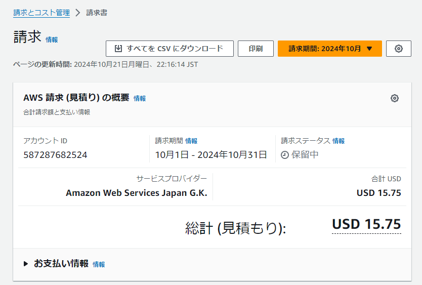
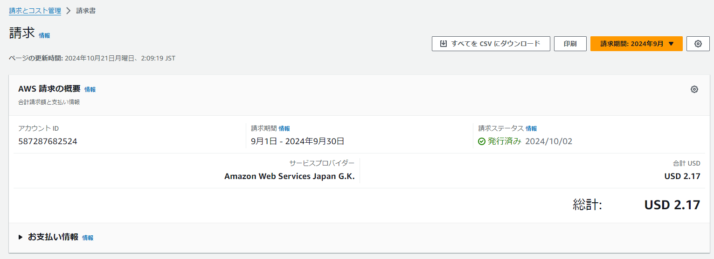

## 第6回課題

### CloudTrailイベント情報

**イベント名**  
TerminateInstances

**含まれている内容**  
- イベント時間
- ユーザー名
- イベントソース

### CloudWatch アラーム

**サンプルアプリ起動時の通知メール（OK）**  
  

**サンプルアプリ停止時の通知メール（ALARM）**  
  

**UnHealthyHostCount詳細画面**  
  

### AWS利用料金見積もり
**第5回課題の構成の見積もり**  
https://calculator.aws/#/estimate?id=d85d03a8a68125cb3773faff0bc9530098edc683  

**現在の利用料**  
  

**先月のEC2利用料金**  
  

**無料利用枠で収まっているか**  
アカウント作成から12カ月経過しているため、無料利用枠の対象外

### 講座感想
EC2はこまめに停止していましたが、RDSを使い始めた際にRDSを停止できることを認識しておらず、しばらく起動したままにしてしまったため、今月の請求がやや高額になってしまいました。今後はコストを意識しつつ、利用料金を抑えるための適切な運用方法をしっかりと検討したいと思います。
